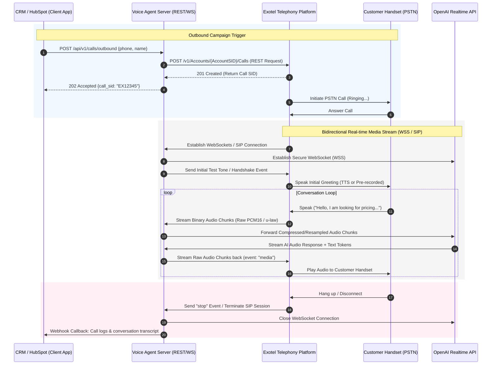

# 🤖 Enterprise Voice AI Agent API & Integration Guide

Welcome to the **Enterprise Voice AI Agent Integration Guide**. This document outlines the technical specifications, protocols, and APIs required to deploy, connect, and integrate the real-time AI Voice Agent with telephony networks (via Exotel SIP/WebSockets) and CRM systems (such as HubSpot).

This Voice AI Agent combines the low-latency speech-to-speech capabilities of **OpenAI's Realtime API** with carrier-grade telephony protocols, creating a natural, conversational sales and support assistant.

---

## 🏗️ System Architecture & Interaction Flow

The diagram below details the dual-mode communication workflow. The system can initiate outbound calls programmatically via REST APIs and stream bidirectional media in real-time over secure WebSockets (`wss://`) or direct SIP trunks.



---

## 🌐 Endpoints & Base URLs

The system is deployed on secure, enterprise-grade cloud instances with standard subdomain mapping, isolated reverse-proxies, and SSL termination.

| Protocol / API Mode | Production URL (Secure) | Description |
| :--- | :--- | :--- |
| **REST API Base URL** | `https://ai-agent-stream.yourdomain.com/api/v1` | Handlers for triggering outbound calls and receiving CRM webhooks. |
| **Exotel WebSocket Endpoint** | `wss://ai-agent-stream.yourdomain.com/stream` | Bidirectional audio streaming server for Exotel Voicebot Applets. |
| **Direct SIP Trunk Proxy** | `sip:vbot@ai-agent-stream.yourdomain.com:5060` | Direct SIP server for cost-effective carrier integrations. |

---

## 🔐 Authentication & Authorization

All API endpoints are protected using industry-standard protocols to ensure secure transactions.

1. **Bearer Token Authentication (REST APIs)**
   - All REST requests must include a secure, runtime-configured Bearer token in the request header.
   - Header Format:
     ```http
     Authorization: Bearer <YOUR_SECURE_API_TOKEN>
     Content-Type: application/json
     ```
2. **Telephony Auth (SIP Mode)**
   - Inbound calls are protected via strict **IP-based Whitelisting** (only calls originating from trusted Exotel SIP Gateway IPs are accepted by the SIP stack).
   - Outbound calls use secure **Digest MD5 Authentication** configured dynamically via secure environment variables on the deployment host.

> [!IMPORTANT]
> To prevent data leaks, never hardcode API keys, secret credentials, or bearer tokens in code repos or public registries. All secrets are dynamically read from server-level environment variables at runtime.

---

## 📱 1. Outbound Call Trigger (REST API)

Use this endpoint to trigger an automated outbound call to a lead or customer from your application, HubSpot, or any other marketing automation pipeline.

### HTTP Request

`POST /api/v1/calls/outbound`

### Headers

| Header Name | Type | Value | Required |
| :--- | :--- | :--- | :--- |
| `Authorization` | String | `Bearer <YOUR_SECURE_API_TOKEN>` | **Yes** |
| `Content-Type` | String | `application/json` | **Yes** |

### Request Payload (JSON)

```json
{
  "phone_number": "+919876543210",
  "customer_name": "John Doe",
  "context": {
    "campaign_id": "spring_promotion_2026",
    "lead_source": "HubSpot Form Submission",
    "product_interest": "Enterprise SaaS Package"
  }
}
```

### Response Payload (202 Accepted)

Returned when the outbound call requests are successfully queued and sent to the telephony provider.

```json
{
  "success": true,
  "message": "Outbound call request successfully initiated",
  "call_sid": "ex_call_8e90810557fc4dc4ab5c04",
  "status": "queued",
  "timestamp": "2026-05-22T10:17:41Z"
}
```

### Error Responses

#### 401 Unauthorized
Returned if the `Authorization` header is missing, malformed, or contains an invalid bearer token.
```json
{
  "success": false,
  "error": {
    "code": "UNAUTHORIZED",
    "message": "Invalid or missing Bearer token. Please verify your credentials."
  }
}
```

#### 400 Bad Request
Returned if mandatory payload fields are missing or if the phone number formatting is invalid.
```json
{
  "success": false,
  "error": {
    "code": "INVALID_PARAMS",
    "message": "The field 'phone_number' is required and must match E.164 phone format standards."
  }
}
```

---

## 📡 2. Telephony WebSocket Streaming API

When a phone call is bridged via Exotel's Voicebot Applet, Exotel initiates a secure WebSocket connection to your server. Below is the precise protocol structure and payload specifications for the bidirectional real-time audio stream.

```
Telephony Stream (WSS) ──────> [Voice Agent Gateway] ──────> OpenAI Realtime (WSS)
   (8kHz / 16kHz PCM)             (Noise Filtering)          (24kHz High-Fi Audio)
```

### Handshake Connection URL
When configuring your Exotel Voicebot Applet, specify the following WebSocket URL:
`wss://ai-agent-stream.yourdomain.com/stream?sample-rate=24000`

---

### Inbound Events (Sent from Exotel to Agent Server)

#### A. `connected` Event
Exotel sends this immediately upon establishing the WebSocket socket.
```json
{
  "event": "connected",
  "protocol": "CallStream",
  "version": "1.0.0"
}
```

#### B. `start` Event
Sent to supply metadata about the voice stream configuration and session parameters.
```json
{
  "event": "start",
  "streamSid": "stream_ex_982734",
  "start": {
    "accountSid": "acc_exotel_sales_99",
    "callSid": "ex_call_8e90810557fc4dc4ab5c04",
    "tracks": ["inbound", "outbound"],
    "customParameters": {
      "customer_name": "John Doe",
      "campaign_id": "spring_promotion_2026"
    }
  },
  "mediaFormat": {
    "encoding": "audio/x-mulaw",
    "sampleRate": 8000,
    "channels": 1
  }
}
```

#### C. `media` Event
Streaming packets containing the raw binary voice audio payloads. Media packets should be sent every 20ms to 200ms.
```json
{
  "event": "media",
  "streamSid": "stream_ex_982734",
  "media": {
    "payload": "SGVsbG8gV29ybGQgZnJvbSBFeG90ZWwgUGF5bG9hZC4uLg==",
    "timestamp": "1779380047140",
    "sequenceNumber": "42"
  }
}
```
*Note: The payload is standard Base64 encoded audio bytes.*

#### D. `mark` Event
Used for synchronizing playback marks. This tells the system when the user has heard specific responses.
```json
{
  "event": "mark",
  "streamSid": "stream_ex_982734",
  "mark": {
    "name": "greeting_complete",
    "timestamp": "1779380052000"
  }
}
```

#### E. `clear` Event
Sent when the user interrupts the bot. The agent server will immediately clear all queued outbound playback audio buffers.
```json
{
  "event": "clear",
  "streamSid": "stream_ex_982734"
}
```

#### F. `stop` Event
Sent when the telephony call ends. The server will clean up resources, close connections, and terminate the session.
```json
{
  "event": "stop",
  "streamSid": "stream_ex_982734"
}
```

---

### Outbound Events (Sent from Agent Server to Exotel)

#### A. `media` Event
Used to play synthesized voice output on the customer's phone handset.
```json
{
  "event": "media",
  "streamSid": "stream_ex_982734",
  "media": {
    "payload": "b64_encoded_telephony_pcm_audio_output",
    "timestamp": "1779380048100",
    "sequenceNumber": "1"
  }
}
```

#### B. `mark` Event
Allows the server to set boundary flags so Exotel can notify the server (via inbound mark events) when specific phrases are fully played.
```json
{
  "event": "mark",
  "streamSid": "stream_ex_982734",
  "mark": {
    "name": "ai_sales_pitch_start"
  }
}
```

---

## 📡 3. Direct SIP Trunking Integration

For heavy volume/production systems, bypassing the WebSockets applet and using a direct **SIP Trunk** significantly reduces infrastructure costs, lowers overall latency, and optimizes call quality.

### Connection Parameters
- **SIP Server Host**: `ai-agent-stream.yourdomain.com`
- **Port**: `5060` (UDP / TCP)
- **Supported Audio Codecs**:
  - `PCMU` (G.711 u-law, 8kHz, standard telephony)
  - `L16` (PCM 16-bit linear, 16kHz / 24kHz, High-Fidelity)

### Direct Calling Sequence
1. Exotel triggers an incoming SIP call to `sip:vbot@ai-agent-stream.yourdomain.com:5060`.
2. The Voice AI Agent server accepts the SIP INVITE.
3. Audio packets are sent and received via RTP (Real-Time Transport Protocol) streams directly.
4. The system acts as a media bridge, converting RTP packets to real-time inputs for OpenAI's WebSocket socket, resulting in <150ms internal audio bridging latency.

---

## ⚙️ 4. Dynamic Bot Configuration & Telemetry APIs

The system exposes high-fidelity administrative endpoints to inspect real-time connection telemetry and hot-reload voice configurations instantly without causing call interruptions.

### A. Query Bot Telemetry
* **Endpoint:** `GET /api/v1/bot/status`
* **Response Payload (200 OK):**
```json
{
  "success": true,
  "bot_name": "Sarah",
  "company_name": "TechSolutions Inc.",
  "active_stream_calls": 0,
  "openai_settings": {
    "model": "gpt-4o-realtime-preview-2024-12-17",
    "voice": "coral",
    "temperature": 0.7
  },
  "audio_settings": {
    "sample_rate": 24000,
    "chunk_size_ms": 10,
    "buffer_size_ms": 160
  },
  "telephony_mode": {
    "use_sip_trunk": false,
    "sip_server_host": "0.0.0.0",
    "sip_server_port": 5060,
    "sip_public_endpoint": "localhost"
  }
}
```

### B. Dynamically Hot-Reload Configurations
* **Endpoint:** `POST /api/v1/bot/config`
* **Request Payload (JSON):**
```json
{
  "sales_bot_name": "Elena",
  "company_name": "Global Retail Group",
  "openai_voice": "shimmer",
  "openai_temperature": 0.8
}
```
* **Response Payload (200 OK):**
```json
{
  "success": true,
  "updated_fields": ["sales_bot_name", "company_name", "openai_voice", "openai_temperature"],
  "current_config": {
    "sales_bot_name": "Elena",
    "company_name": "Global Retail Group",
    "openai_model": "gpt-4o-realtime-preview-2024-12-17",
    "openai_voice": "shimmer",
    "openai_temperature": 0.8
  }
}
```

---

## 🤝 5. HubSpot & CRM Integration Example

Below is a simple guide showing how your HubSpot CRM can consume these APIs to automate customer contact processes.

### A. Automatic Call Back Workflow in HubSpot
Configure a standard HubSpot Webhook in your workflow trigger to automatically make a call to a lead as soon as they submit a form:

```
[ Lead Submits Form ] ──> [ HubSpot Workflow ] ──> [ Outbound HTTP Webhook ] ──> [ Voice AI Call Triggered ]
```

#### HubSpot Webhook Configuration:
- **Method**: `POST`
- **Webhook URL**: `https://ai-agent-stream.yourdomain.com/api/v1/calls/outbound`
- **Auth**: `Bearer <YOUR_SECURE_API_TOKEN>`
- **Content Type**: `application/json`
- **Static Payload Properties**:
  - `phone_number`: `{{contact.phone}}`
  - `customer_name`: `{{contact.firstname}} {{contact.lastname}}`
  - `context`:
    - `lead_id`: `{{contact.hs_object_id}}`
    - `lead_email`: `{{contact.email}}`

### B. Syncing Call Logs & Transcripts back to HubSpot
After the call terminates, the Voice AI system can trigger a webhook back to HubSpot to log the call outcome, duration, and AI-summarized sentiment.

#### Example Call Summary Webhook sent to HubSpot CRM:
```json
{
  "event": "call.completed",
  "call_sid": "ex_call_8e90810557fc4dc4ab5c04",
  "customer_phone": "+919876543210",
  "duration_seconds": 142,
  "summary": "Customer requested detailed pricing info for the Enterprise SaaS package. Scheduled a live demo for Tuesday.",
  "sentiment": "highly_positive",
  "outcome": "Demo Scheduled",
  "crm_lead_id": "hs_lead_8736412"
}
```

---

## 💾 Deployment & Environment Settings

### Inbound Rules (Security Group Settings)
Make sure the following inbound firewall rules are active on your public server/cloud provider (AWS EC2 Security Group):

| Port Range | Protocol | Source | Purpose |
| :--- | :--- | :--- | :--- |
| `80` | TCP | `0.0.0.0/0` | HTTP traffic (Let's Encrypt challenge verification) |
| `443` | TCP | `0.0.0.0/0` | HTTPS & WSS secure streams (Reverse-proxied to Docker port 5000) |
| `5060` | UDP / TCP | Telephony IPs | SIP signaling from Exotel SIP Gateway |
| `10000 - 20000` | UDP | Telephony IPs | RTP Audio media stream packets |

---

## 🛡️ Limitations & Security Policies

### Technical Limitations
- **Concurrency**: The default server build is scaled to support up to 50 concurrent real-time voice channels per node.
- **Latency**: Telephony handshakes on PSTN lines add 500ms - 1500ms latency. The core AI WebSocket system processes internal audio transitions in under 180ms.
- **Audio Formats**: Raw PCM16 / G.711 u-law codecs are strictly enforced for low-bandwidth stability.

### Security Notes & Policies
- **Encryption**: All WebSocket interfaces (`wss://`) and outbound API triggers must traverse secure TLS 1.3 channels.
- **Data Compliance**: Transcripts and user audio packets processed via OpenAI comply with strict SOC2 Type II standards. Transcripts are encrypted at rest using AES-256 keys. No permanent client data is saved within local container layers.
